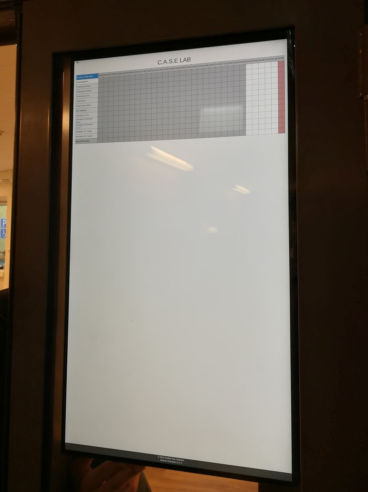

# RPI_infoscreen
#### A guide on how to setup a Raspberry Pi (4) to automatically load a webpage and display it in portrait mode. 

<p align="center">
  <a href=info_screen.jpg">
    
  </a>
</p>
     
     
## Screen rotation
This guide is primaly developed for displaying a webpage using a 
Raspberry Pi 4 and is so far only tested on that one. However there
should be no major difference using this guide on earlier versions of
Raspberry Pi.

##### Rotating the screen
So far our only way of rotating the screen is by manually rotating the
screen in via the GUI using 
Raspbian. This may be fixed in later updates.


## Autoload webpage (Kios Mode)
This guide is a based on the guide from 
[pimylifeup.com/raspberry-pi-kiosk ](https://pimylifeup.com/raspberry-pi-kiosk/)
and is in our case customized for displaying our local booking-system.
For deeper understanding of the this installation and "Kiosk mode" we
recommend looking at the link above.

### Setup the raspberry in kiosk mode
1. We start off by cleaning the the Raspina image of things unnecessary
to the function of kiosk mode. This will reduce used space and minimize 
the number of packages being updated.

```bash
sudo apt-get purge wolfram-engine scratch scratch2 nuscratch sonic-pi idle3 -y
sudo apt-get purge smartsim java-common minecraft-pi libreoffice* -y
```

2. Do some cleanup
```bash
sudo apt-get clean
sudo apt-get autoremove -y
```

3. Update
```bash
sudo apt-get update
sudo apt-get upgrade
```

4. Install tool for hiding mouse
```bash
sudo apt-get install xdotool unclutter sed
```

5. Configure Raspbian for autologin, this should be default but if not 
change the settings via
```bash
sudo raspi-config
```

### Making and configure the Kiosk script

1. Make the a script called kiosk.sh
```bash
nano /home/pi/kiosk.sh
```

2. In the script enter the following text.

```shell
#!/bin/bash
xset s noblank
xset s off
xset -dpms

unclutter -idle 0.5 -root &

sed -i 's/"exited_cleanly":false/"exited_cleanly":true/' /home/pi/.config/chromium/Default/Preferences
sed -i 's/"exit_type":"Crashed"/"exit_type":"Normal"/' /home/pi/.config/chromium/Default/Preferences

/usr/bin/chromium-browser --noerrdialogs --disable-infobars --kiosk caselabbet.se https://www.caselabbet.se/association/info &

while true; do
   xdotool keydown ctrl+Tab; xdotool keyup ctrl+Tab;
   sleep 10
done
```
Save the file.

3. [Optional] Modify the script. You can change the URL on line 11 to
sute your usage. You can also add multiple webpages with just a blank
 line separation. The script will then change between the with the
 interval defined on line 15.  

### Setting up the Raspberry Pi Kiosk to start at boot

We now need to make a service that handel the initialization of the 
script at boot.

1. Start by making sure the ID of the display. Usually 0.
```bash
echo $DISPLAY
```

2. Make the service

```bash
sudo nano /lib/systemd/system/kiosk.service
```

3. Enter the following text. Replace the number in "Environment=DISPLAY=:0.0" 
to that of your display. Make sure the path to the script is correct if 
you done any modification to it.

```shell
[Unit]
Description=Chromium Kiosk 
Wants=graphical.target
After=graphical.target

[Service]
Environment=DISPLAY=:0.0
Environment=XAUTHORITY=/home/pi/.Xauthority
Type=simple
ExecStart=/bin/bash /home/pi/kiosk.sh
Restart=on-abort
User=pi
Group=pi

[Install]
WantedBy=graphical.target
```
Save the file.

4. Enable and start the service.
```bash
sudo systemctl enable kiosk.service
sudo systemctl start kiosk.service
```

5. Check if the service is running correct
```bash
sudo systemctl status kiosk.service
```
The command should show the service status as **Active: active (running)**
. If this is true everything should be up and running. Test everything by
rebooting the system. It is normal for the system to first boot to 
the desktop and then load the webpage.

6. Reboot the system
```bash
sudo reboot
```
